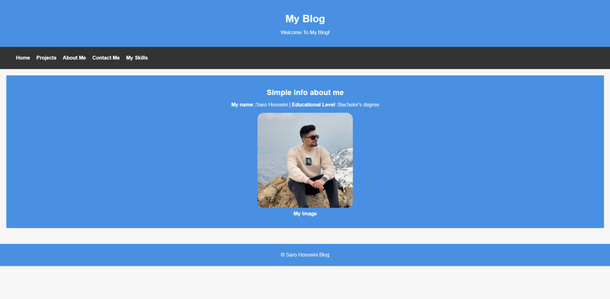

## 🌐 Personal Portfolio Website
<br>

#### This is a simple personal portfolio website built using HTML and CSS.
##### The goal of this project is to showcase my information, skills, and Daneshkar projects in a clean and minimal way.

<br>

The website is fully deployed using GitHub Pages.

___

---

***


>### 📌  Features

>> #### ✔️ Home Page

+ Basic introduction

+ Navigation menu linking to all pages

+ Profile image section

>> #### ✔️ About Page

+ Short bio about me

+ My interests and educational background

>> #### ✔️ Projects Page

+ List of my Daneshkar projects

+ Short description for each project

+ Direct GitHub links to the repositories

+ Simple card-style layout for better readability

>> #### ✔️ Contact Page

+ Simple contact form

+ Fields for name, email, number, and message
___

---

***

## 🛠️ Technologies Used
<br>

+ HTML5

+ CSS3 (basic styling, layout, spacing, forms, navigation bar)

+ Git & GitHub

+ GitHub Pages for deployment
<br> 


### 📂  Project Structure :
```
Simple-Blog/
├── index.html
├── about.html
├── projects.html
├── contact.html
├── css/
│   └── style.css
└── images/
    └── self-image.jpg

```
<br>

>### 🚀 Deployment
>>This website is deployed using GitHub Pages.
To visit the live version:
>>>👉 (https://saro1010.github.io/Simple-Blog)

> ### 📸 Screenshot
>>### Home page
>>

>### ✨ Purpose of This Project

+ Practice working with HTML & CSS

+ Learn how to structure a basic website

+ Learn Git & GitHub workflow

+ Deploy a real website using GitHub Pages

+ Showcase projects in a clean and organized format


